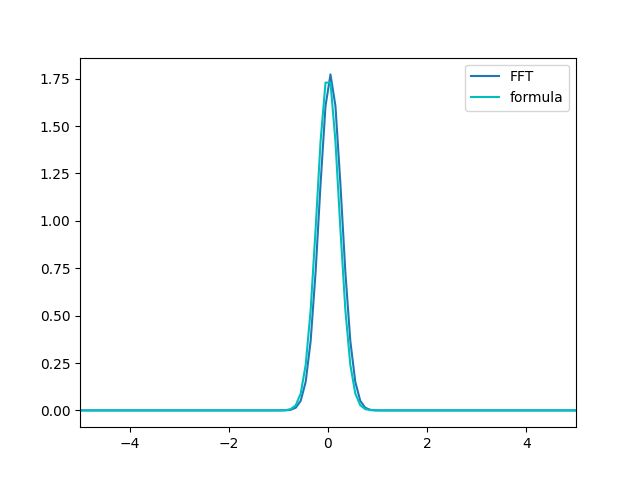
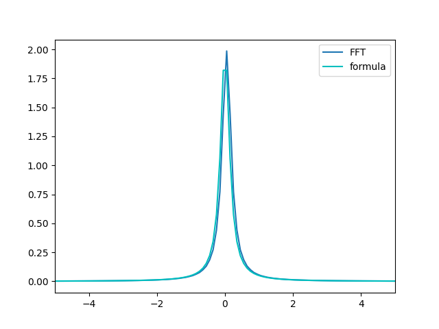
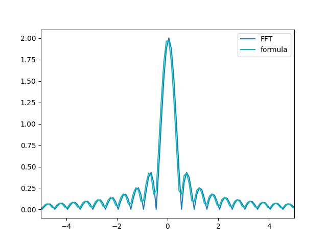
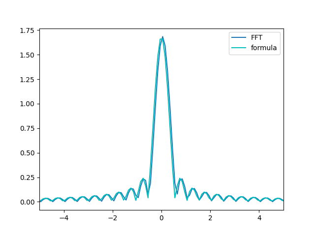

# Computer Modelling of Complex Systems - FFT

## Week 1

Perform FFT and compare it with analytical formulas:

### Gaussian function

$$G(x) = e^{-x^2}$$ //testing TeX support for web version

### Lorentzian function

$$ \Gamma(x) = e^{-|x|} $$

### Step function

$$ S(x) = \theta(x+1) - \theta(x-1) $$

### Step function modulated with cos

$$ C(x) = (\theta(x+1) - \theta(x-1))\cdot \cos(x) $$

