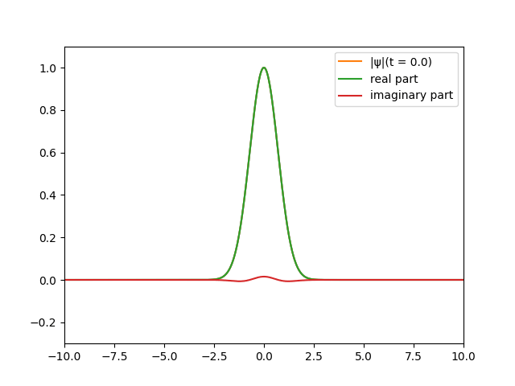

# Computer Modelling of Complex Systems - FFT

## Week 1

Perform FFT and compare it with analytical formulas:

### Gaussian function

$$G(x) = e^{-x^2}$$

$$\hat{G}(x) = \sqrt{\pi} e^{-\pi^2 \cdot k^2}$$

### Lorentzian function

$$ \Gamma(x) = e^{-|x|} $$

$$\hat{\Gamma}(x) = \frac{2}{4\pi^2k^2+1}$$

### Step function

$$ S(x) = \theta(x+1) - \theta(x-1) $$

$$\hat{S}(x) = ie^{2i\pi k}\frac{-1+e^{-4i\pi k}}{2\pi k}$$

### Step function modulated with cos

$$ C(x) = (\theta(x+1) - \theta(x-1))\cdot \cos(x) $$

$$\hat{C}(x) = - \frac{i}{2(4\pi^2 k^2 - 1)} e^{-i(2\pi k + 1)}(-2\pi k + e^{4 i \pi k + 2i}(2 \pi k - 1) + e^{4 i \pi k}(2\pi k + 1) - e^{2i}(2\pi k + 1)+1)$$

## Week 2

Employ the Baker Hausdorf formula to evolve a free gaussian wave function

$$ \Psi(x, t+\delta t) = \int dk \Psi(k) \exp(-i\delta t k^2) \exp(i k x) $$

## Week 3

Propagate Gaussian pulses

$$ A(z, t) = A_0 \frac{t_0}{t_0^2 - i \beta_2 z} e^{-\frac{1}{2} \frac{(t-\beta_1 z)^2}{t_0^2 - i \beta_2 z}} $$

